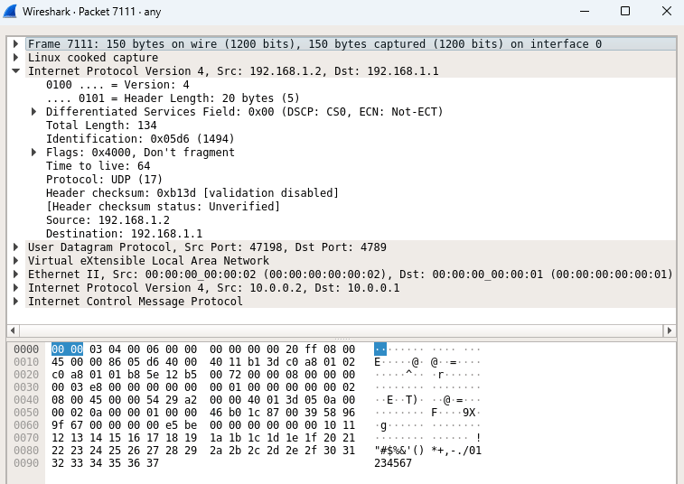
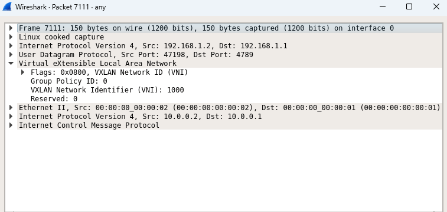

# VXLAN-Simulation

> VXLAN-Simulation è un progetto pensato per dimostrare l'incapsulamento di pacchetti Layer 2 in una rete IP/UDP utilizzando VXLAN.
> Il sistema permette di simulare una topologia di rete virtuale flessibile, garantendo la corretta trasmissione dei dati tra host tramite tunnel VXLAN.
> I pacchetti VXLAN vengono analizzati con **Wireshark** per verificare l'incapsulamento e il trasporto dei dati tra host virtualizzati.

## 📌 Contenuti
- [Struttura del progetto](#struttura-del-progetto)
- [Cos'è VXLAN](#cosè-vxlan)
- [Descrizione della topologia](#descrizione-della-topologia)
- [Descrizione WorkFlow](#descrizione-workflow)
- [Materiale multimediale](#materiale-multimediale)
- [Contributors](#contributors)


## 📁 Project Structure

La struttura del progetto è organizzata nel seguente modo:
```
VXLAN-Simulation/
│── src/                     # Codice sorgente principale
│   ├── vxlan_controller.py  # Controller Ryu per la gestione del traffico VXLAN
│   ├── vxlan_ultimate.py    # Topologia Mininet e configurazione VXLAN
│── captures/                # Immagini e file che testimoniano la cattura
│   ├── immagine1.png        # Immagine 1
│   ├── immagine2.png        # Immagine 2
│   ├── immagine3.png        # Immagine 3
│── docs/                    # Documentazione del progetto
│── README.md                # Documentazione principale
```

---

## 🌐 Cos'è VXLAN

VXLAN (**Virtual eXtensible Local Area Network**) è un protocollo di **tunneling** che estende le reti Layer 2 su un'infrastruttura **Layer 3** utilizzando **UDP/IP**. Progettato per superare le limitazioni delle VLAN tradizionali, VXLAN offre maggiore scalabilità e flessibilità.

### **Caratteristiche principali**

| Caratteristica             | VLAN               | VXLAN                                   |
| -------------------------- | ------------------ | --------------------------------------- |
| **Identificatore di rete** | VLAN ID (12 bit)   | VXLAN Network Identifier (VNI - 24 bit) |
| **Numero massimo di reti** | 4096 VLAN          | \~16 milioni di VXLAN                   |
| **Ambito**                 | Layer 2 (Ethernet) | Layer 3 (IP/UDP)                        |
| **Tunneling**              | No                 | Sì (UDP 4789)                           |
| **Scalabilità**            | Limitata           | Elevata                                 |

- VXLAN utilizza un **VNI (VXLAN Network Identifier) di 24 bit**, consentendo fino a **16 milioni di reti virtuali**.
- I frame Ethernet vengono incapsulati in **pacchetti UDP**, rendendo VXLAN compatibile con l'infrastruttura IP esistente.

### **Componenti chiave di VXLAN**

- **VTEP (VXLAN Tunnel EndPoint)**: dispositivi che incapsulano e deincapsulano il traffico VXLAN.
- **Outer IP Header**: il pacchetto esterno che trasporta il traffico VXLAN su UDP.
- **UDP Header (porta 4789)**: il trasporto UDP consente la comunicazione VXLAN su reti Layer 3.
- **VXLAN Header**: contiene il **VNI**, che identifica la rete virtuale.
- **Inner Ethernet Frame**: il pacchetto Ethernet originale incapsulato.

### **Struttura del pacchetto VXLAN**
| **Livello** | **Componente** | **Descrizione** |
|------------|--------------|----------------|
| 1 | **Ethernet (Outer Ethernet Frame)** | Frame Ethernet esterno per l'incapsulamento VXLAN |
| 2 | **IP Header (Outer IP Header)** | Intestazione IP esterna per il tunneling VXLAN |
| 3 | **UDP Header (Dest. Port 4789 - VXLAN)** | Intestazione UDP con porta di destinazione 4789 (standard VXLAN) |
| 4 | **VXLAN Header** | Intestazione VXLAN contenente informazioni di virtualizzazione |
| 4.1 | **Flag** | Bit di controllo per identificare il pacchetto VXLAN |
| 4.2 | **VXLAN Network Identifier (VNI)** | Identificatore di rete VXLAN (24 bit) |
| 5 | **Ethernet (Inner Ethernet Frame)** | Frame Ethernet originale trasportato all'interno del tunnel |
| 6 | **Payload originale** | Dati originali (IP, ARP, ICMP, ecc.) incapsulati nel tunnel VXLAN |

### **Vantaggi di VXLAN**
- ✔ **Scalabilità**: fino a 16 milioni di reti virtuali.
- ✔ **Supporto per reti Layer 3**: tunneling su UDP per estendere la connettività tra data center.
- ✔ **Isolamento del traffico**: maggiore separazione delle reti rispetto alle VLAN.
- ✔ **Integrazione con SDN**: VXLAN è compatibile con controller di rete per la gestione dinamica.

### **Funzionamento del Tunneling VXLAN**
1. Un host invia un **pacchetto Ethernet** a un VTEP.
2. Il VTEP **incapsula** il pacchetto Ethernet in un **pacchetto VXLAN** con il **VNI** appropriato.
3. Il pacchetto VXLAN viene inoltrato sulla **rete IP** come un normale pacchetto UDP.
4. Il VTEP di destinazione **deincapsula** il pacchetto, ripristinando il frame Ethernet originale.
5. Il frame Ethernet viene inviato alla destinazione finale.


## 🗺️ Descrizione della Topologia

La topologia simulata nel progetto è composta da:
- **Due switch OVS** connessi tra loro tramite un tunnel VXLAN.
- **Due host** connessi rispettivamente ai due switch.
- **Ryu Controller**, che gestisce le regole di instradamento e l'analisi dei pacchetti.

Il diagramma della topologia è il seguente:

```
[ h1 ] --- (s1) --- VXLAN Tunnel --- (s2) --- [ h2 ]
```

Ogni switch Open vSwitch (OVS) è configurato per incapsulare il traffico proveniente dall'host in un pacchetto VXLAN e inviarlo attraverso il tunnel.


## 🚀 Installazione & esecuzione del progetto

### 1️⃣ Installare le dipendenze
Per eseguire il progetto, è necessario installare:
```bash
sudo apt update && sudo apt install mininet openvswitch-switch wireshark python3-ryu
```

### 2️⃣ Clonare la repository
```bash
git clone https://github.com/Zefkilis2002/VXLAN-Simulation.git
cd VXLAN-Simulation
```

### 3️⃣ Avviare la simulazione della rete
```bash
sudo python3 src/vxlan_ultimate.py
```

### 4️⃣ Avviare il controller Ryu
```bash
ryu-manager src/vxlan_controller.py
```

### 5️⃣ Verificare la connettività tra gli host
```bash
h1 ping h2
```

### 6️⃣ Monitorare il traffico VXLAN con Wireshark
```bash
tcpdump -i any -nn port 4789
```


## 🔄 Descrizione del WorkFlow

1️⃣ **Configurazione della rete**
   - Mininet avvia due switch OVS e due host.
   - Viene stabilito un tunnel VXLAN tra gli switch.

2️⃣ **Gestione del traffico con Ryu**
   - Il controller riceve pacchetti e applica le regole di instradamento.
   - Registra i pacchetti VXLAN e i loro dettagli (VNI, IP, MAC).

3️⃣ **Cattura e analisi con Wireshark**
   - Wireshark monitora i pacchetti UDP sulla porta 4789.
   - È possibile esaminare l'intestazione VXLAN e il frame Ethernet incapsulato.


## 🔄 Flusso di lavoro

1. **Configurazione della topologia Mininet**
    - Due switch OVS collegati tramite un tunnel VXLAN.
    - Due host connessi ai rispettivi switch.

2. **Creazione del tunnel VXLAN**
    - Configurazione automatica tramite Open vSwitch.
    - Flussi OpenFlow aggiunti dal controller Ryu.

3. **Analisi dei pacchetti**
    - Wireshark viene utilizzato per catturare e analizzare i pacchetti VXLAN.
    - Verifica dell'incapsulamento dei frame Layer 2 all'interno dei pacchetti IP/UDP.

## 📂 Material

Esempio di pacchetto VXLAN catturato in Wireshark:

<p align="center">
    
</p>

Analisi dell'intestazione VXLAN:

<p align="center">
    
</p>


## 👥 Contributors

- **Zefkilis2002** - Sviluppatore principale

Se desideri contribuire, puoi aprire una pull request o contattarmi direttamente! 🚀
