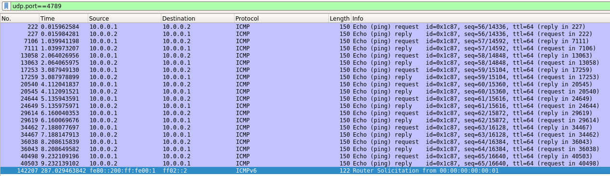

Italian version [here](README_ITA.md)

---

# VXLAN-Simulation
> VXLAN-Simulation is a project designed to demonstrate the encapsulation of Layer 2 packets in an IP/UDP network using VXLAN.
> The system allows simulating a flexible virtual network topology, ensuring the correct transmission of data between hosts through VXLAN tunnels.
> VXLAN packets are analyzed with **Wireshark** to verify encapsulation and data transport between virtualized hosts.

## 📌 Contents
- [Project Structure](#project-structure)
- [What is VXLAN](#what-is-vxlan)
- [Topology Description](#topology-description)
- [Workflow Description](#workflow-description)
- [Multimedia Material](#multimedia-material)
- [Contributors](#contributors)

## 📁 Project Structure
The project structure is organized as follows:
```
VXLAN-Simulation/
│── src/                     # Main source code
│   ├── vxlan_topology_1.py  # First Mininet topology with VXLAN configuration
│   ├── vxlan_topology_2.py  # Second Mininet topology with VXLAN configuration
│── captures/                # Images and files showing packet capture
│   ├── cattura_gener.png    # Image 1
│   ├── vxlan_head.png       # Image 2
│   ├── vxlan_packs.png      # Image 3
│   ├── Topologia_Vxlan.png   # Image 4
│── Simulazione VXLAN.pdf    # Project presentation
│── README.md                # Main documentation
│── README_ITA.md            # Italian Main documentation
```
---
## 🌐 What is VXLAN
VXLAN (**Virtual eXtensible Local Area Network**) is a **tunneling** protocol that extends Layer 2 networks over a **Layer 3** infrastructure using **UDP/IP**. Designed to overcome traditional VLAN limitations, VXLAN offers greater scalability and flexibility.
### **Key Features**
| Feature                   | VLAN               | VXLAN                                   |
|-------------------------- |------------------ |--------------------------------------- |
| **Network Identifier**    | VLAN ID (12-bit)  | VXLAN Network Identifier (VNI - 24-bit) |
| **Maximum Networks**      | 4096 VLAN         | ~16 million VXLAN                     |
| **Scope**                 | Layer 2 (Ethernet)| Layer 3 (IP/UDP)                      |
| **Tunneling**             | No                | Yes (UDP 4789)                        |
| **Scalability**           | Limited           | High                                  |
- VXLAN uses a **24-bit VNI (VXLAN Network Identifier)**, allowing up to **16 million virtual networks**.
- Ethernet frames are encapsulated in **UDP packets**, making VXLAN compatible with existing IP infrastructure.
### **Key VXLAN Components**
- **VTEP (VXLAN Tunnel EndPoint)**: devices that encapsulate and decapsulate VXLAN traffic.
- **Outer IP Header**: the external packet that transports VXLAN traffic over UDP.
- **UDP Header (Port 4789)**: UDP transport enables VXLAN communication over Layer 3 networks.
- **VXLAN Header**: contains the **VNI**, which identifies the virtual network.
- **Inner Ethernet Frame**: the original Ethernet packet encapsulated.
### **VXLAN Packet Structure**
| **Layer** | **Component** | **Description** |
|----------|--------------|----------------|
| 1        | **Ethernet (Outer Ethernet Frame)** | Outer Ethernet frame for VXLAN encapsulation |
| 2        | **IP Header (Outer IP Header)** | Outer IP header for VXLAN tunneling |
| 3        | **UDP Header (Dest. Port 4789 - VXLAN)** | UDP header with destination port 4789 (VXLAN standard) |
| 4        | **VXLAN Header** | VXLAN header containing virtualization information |
| 4.1      | **Flag** | Control bits identifying the VXLAN packet |
| 4.2      | **VXLAN Network Identifier (VNI)** | VXLAN network identifier (24-bit) |
| 5        | **Ethernet (Inner Ethernet Frame)** | Original Ethernet frame transported inside the tunnel |
| 6        | **Original Payload** | Original data (IP, ARP, ICMP, etc.) encapsulated in the VXLAN tunnel |
### **VXLAN Advantages**
- ✔ **Scalability**: up to 16 million virtual networks.
- ✔ **Support for Layer 3 networks**: tunneling over UDP to extend connectivity between data centers.
- ✔ **Traffic isolation**: greater network separation compared to VLANs.
- ✔ **Integration with SDN**: VXLAN is compatible with network controllers for dynamic management.
### **VXLAN Tunneling Operation**
1. A host sends an **Ethernet packet** to a VTEP.
2. The VTEP **encapsulates** the Ethernet packet into a **VXLAN packet** with the appropriate **VNI**.
3. The VXLAN packet is forwarded over the **IP network** as a normal UDP packet.
4. The destination VTEP **decapsulates** the packet, restoring the original Ethernet frame.
5. The Ethernet frame is sent to the final destination.

## 🗺️ Topology Description
For the project, we simulated two different topologies, one with **vxlan_topology_1.py** and another with **vxlan_topology_2.py**.
### 1️⃣ Topology of **vxlan_topology_1.py**:
The simulated topology consists of:
- **Two OVS switches** connected via a VXLAN tunnel.
- **Three hosts**, **h1** connected to switch **s1** while **h2** and **h3** are connected to switch **s2**.
- Host **h1** will communicate with **h2** and **h3** using the **VXLAN tunnel**, while **h2** and **h3** will communicate with each other via **VLAN**, as they belong to the same switch.
The topology diagram is as follows:
```
[ h1 ] --- (s1) --- VXLAN Tunnel --- (s2) --- [ h2 ]
                                      |
                                      |
                                    [ h3 ]
```
### 2️⃣ Topology of **vxlan_topology_2.py**:
The simulated topology consists of:
- **Two OVS switches** connected via a VXLAN tunnel.
- **Two hosts**, h1 and h2, connected to the two switches respectively.
The topology diagram is as follows:
```
[ h1 ] --- (s1) --- VXLAN Tunnel --- (s2) --- [ h2 ]
```
Each Open vSwitch (OVS) is configured to encapsulate host traffic into a VXLAN packet and send it through the tunnel.

## 🚀 Installation & Project Execution
### **Virtual Machine Installation and Configuration Guide on VirtualBox**
1. **Install VirtualBox** by downloading it from the official site:  
   🔗 [VirtualBox Download](https://www.virtualbox.org/wiki/Downloads).
2. **Download the virtual machine** from the following link:  
   🔗 [Download VM Image](https://drive.google.com/drive/folders/1FP5Bx2DHp7oV57Ja38_x01ABiw3wK11M?usp=sharing).
3. **Import the virtual machine** into VirtualBox:  
   - Open **VirtualBox** and go to **File → Import Appliance**.
   - Select the downloaded **.ova** file and follow the import instructions.
4. **Configure the virtual machine** after importing:  
   - Go to **Settings → System → Processor** and allocate an appropriate number of CPUs.
   - Go to **Settings → System → Memory** and allocate sufficient RAM.
5. **Start the virtual machine** via VirtualBox.
6. **Connect to the VM via SSH** for easier management:
   ```
   ssh -X -p 2222 vagrant@localhost
   ```

## 🔄 Workflow Description

To test the VXLAN simulation, follow these steps:

1️⃣ **Start the VXLAN network topology**  
   - Run the script to create the virtual network with Mininet and configure the VXLAN tunnels:
   ```
   sudo python3 vxlan_topology_1.py
   ```

2️⃣ **Connect to the virtual machine using MobaXterm to run Wireshark with a graphical interface**  
   - Open **MobaXterm**, connect to the VM where the simulation is running, and start Wireshark:
   ```
   sudo wireshark
   ```

3️⃣ **Capture VXLAN traffic**  
   - Select the **any** interface and apply the filter to intercept VXLAN packets:
   ```
   udp.port == 4789
   ```

4️⃣ **Generate traffic on the simulated network**  
   - In the Mininet terminal, with the VXLAN topology active, execute the command to verify connectivity between hosts:
   ```
   h1 ping h2
   ```

5️⃣ **Analyze the packets captured by Wireshark**  
   - Use the Wireshark application to analyze the captured packets with the "udp.port == 4789" filter active:

<p align="center">
    
    
    
</p>


## 📂 Multimedia Material
Below are useful materials for the project:
- 🔗 [Demonstration Video Execution:](https://www.youtube.com/watch?v=FdMMLcU9ET4&ab_channel=kostazefkilis).
- 🔗 [Project PDF Presentation:](https://github.com/Zefkilis2002/VXLAN-Simulation/blob/main/Simulazione%20VXLAN.pdf).
- 🔗 [Topology 1 image:]([https://github.com/Zefkilis2002/VXLAN-Simulation/blob/main/Simulazione%20VXLAN.pdf](https://github.com/Zefkilis2002/VXLAN-Simulation/blob/main/captures/Topologia_Vxlan.png)).

## 👥 Contributors
- **Zefkilis2002**, k.zefkilis@studenti.unitn.it, 226600
- **LucaPio02**, lucapio.pierno@studenti.unint.it, 228904
